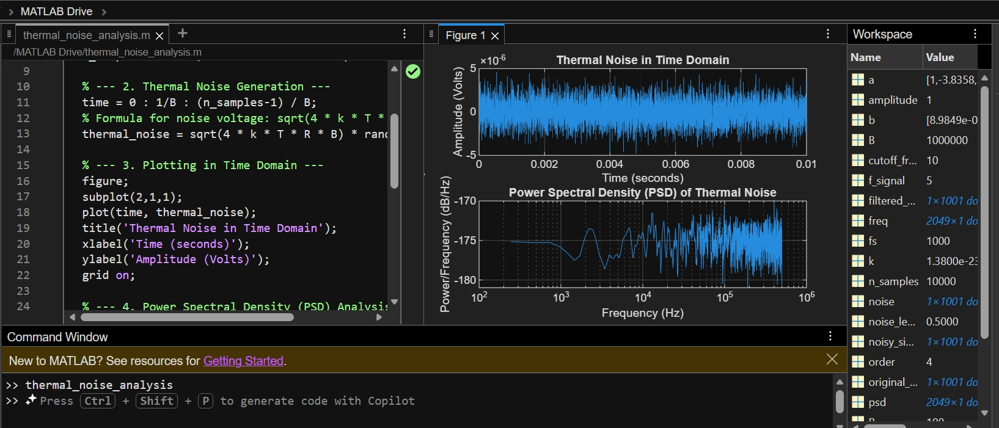

# Thermal Noise Simulation and Analysis

This repository contains a MATLAB simulation used to generate and analyze thermal noise based on physical parameters.

## Objective
To simulate thermal noise and visualize its characteristics in both time and frequency domains.

## Physical Parameters Used
* **Bandwidth (B):** 1 MHz
* **Resistance (R):** 100 ohms
* **Temperature (T):** 300 K

## Results and Visualizations
Below is the simulation output showing the noise in the time domain and its Power Spectral Density (PSD).

## Experiment Steps
1. **Generation:** The noise is generated using the Boltzmann constant ($1.38 \times 10^{-23}$) and the Gaussian distribution (`randn`).
2. **Time Domain Analysis:** A plot is created to observe how the noise amplitude fluctuates over time.
3. **PSD Analysis:** The `pwelch` function is used to show how noise power is distributed across the frequency spectrum.

## How to Run
1. Ensure you have MATLAB installed.
2. Download `thermal_noise_analysis.m`.
3. Run the script in the MATLAB editor to see the generated plots.
